# AnySynth Components

A comprehensive React component library for building synthesizer and audio application UIs. Features 30+ production-ready components with dark/light themes, full accessibility support, and extensive test coverage.

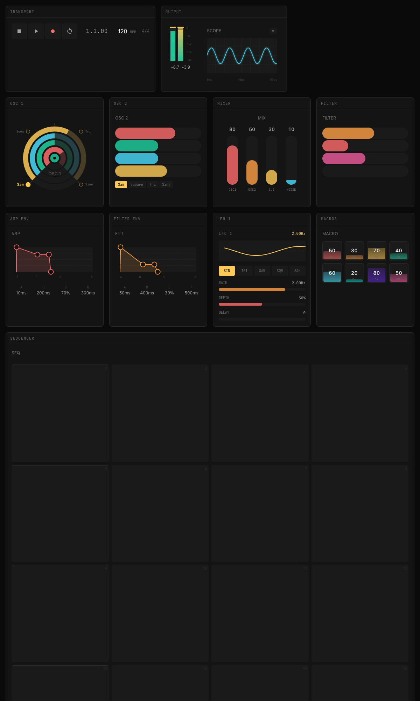

## Features

- **30+ Components** - Knobs, sliders, sequencers, envelopes, meters, and more
- **Dark/Light Themes** - Complete theming system with CSS custom properties
- **Fully Accessible** - ARIA labels, keyboard navigation, screen reader support
- **TypeScript** - Full type definitions for all components and props
- **271 Tests** - Comprehensive test coverage with Vitest
- **Storybook** - Interactive documentation with 100+ stories
- **Zero Dependencies** - Only React as a peer dependency

## Installation

```bash
npm install anysynth-components
```

## Quick Start

```tsx
import { ADSR, LFO, Transport, ThemeProvider } from 'anysynth-components';

function App() {
  const [envelope, setEnvelope] = useState({
    attack: 0.01, decay: 0.2, sustain: 0.7, release: 0.5
  });

  return (
    <ThemeProvider defaultMode="dark">
      <ADSR value={envelope} onChange={setEnvelope} />
    </ThemeProvider>
  );
}
```

## Components

### Controls

| Component | Description | Screenshot |
|-----------|-------------|------------|
| **NestedSlider** | Multi-parameter sliders (horizontal, vertical, circular, grid) | 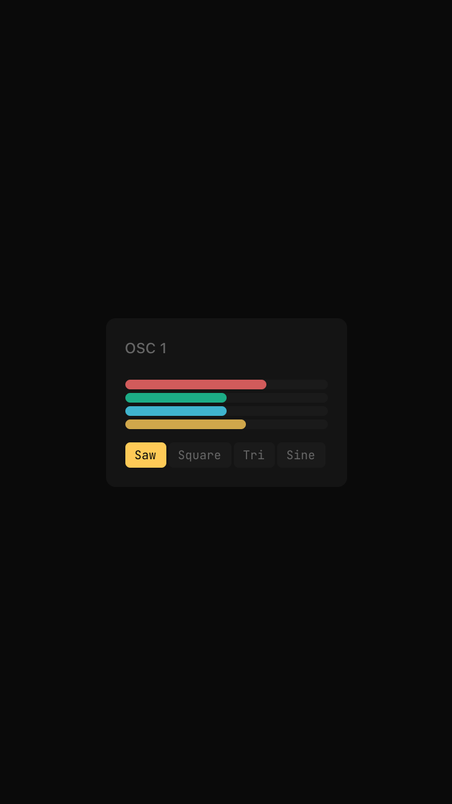 |
| **ModWheel** | Pitch bend and mod wheel with spring return | 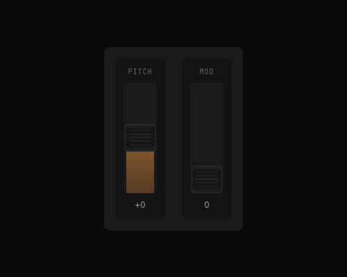 |
| **XYPad** | 2D controller for filter cutoff/resonance | 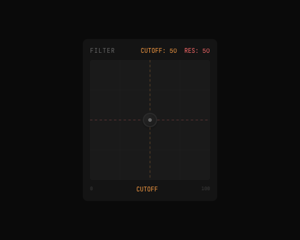 |
| **Transport** | Play, stop, record, loop with BPM | 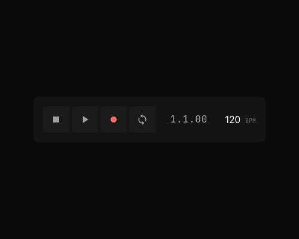 |

### Visualization

| Component | Description | Screenshot |
|-----------|-------------|------------|
| **ADSR** | Attack/Decay/Sustain/Release envelope | 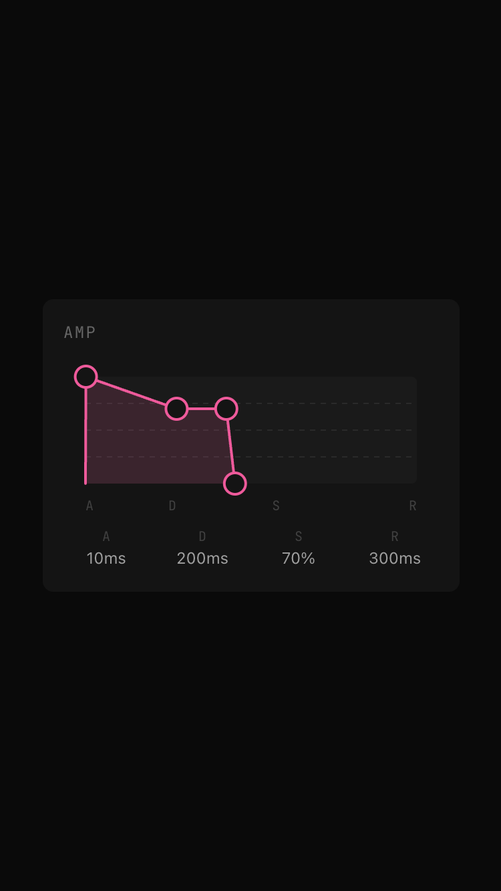 |
| **LFO** | Low frequency oscillator with animated waveform | 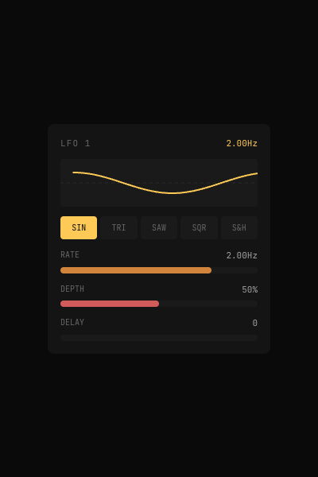 |
| **LevelMeter** | VU/PPM style audio meter | 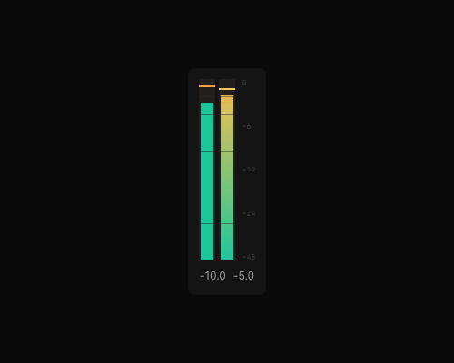 |
| **Oscilloscope** | Real-time waveform and spectrum display | 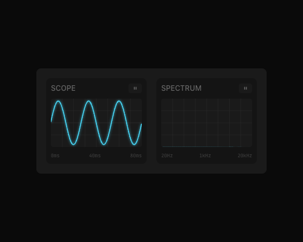 |

### Input

| Component | Description | Screenshot |
|-----------|-------------|------------|
| **PianoKeyboard** | Interactive piano with velocity | 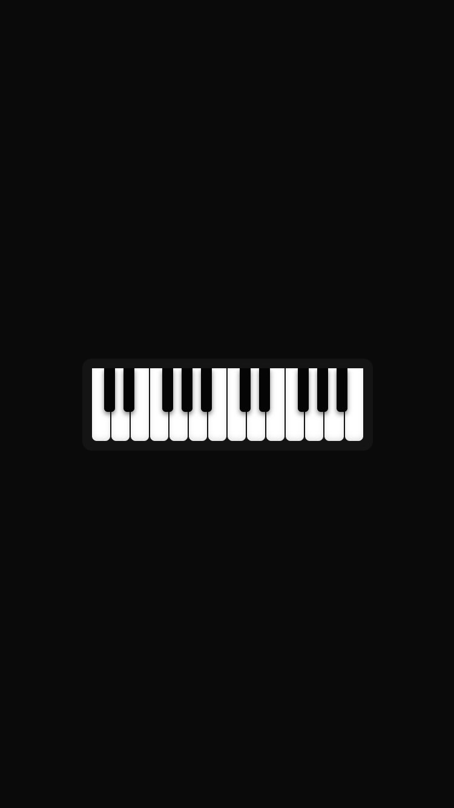 |
| **Sequencer** | 16-step sequencer with note editing | 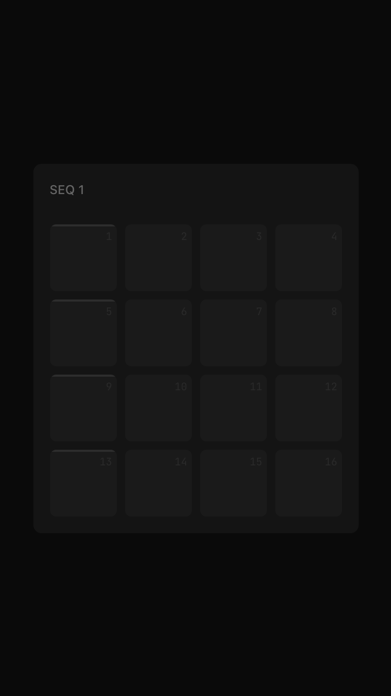 |
| **DrumPad** | MPC-style drum pads and sequencer | 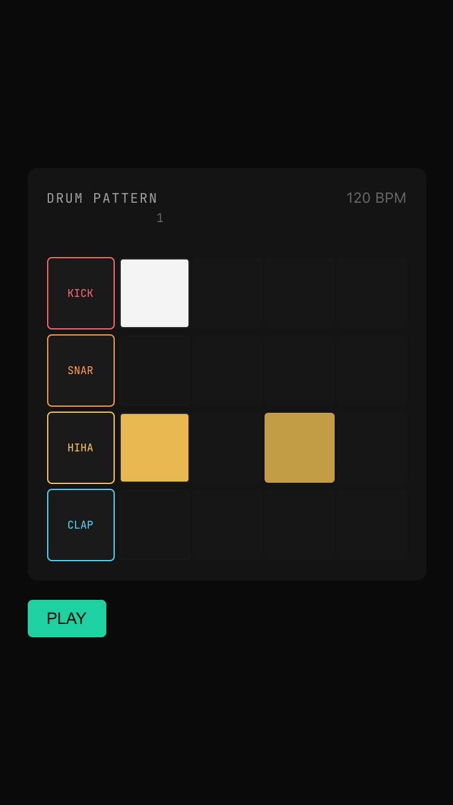 |

### Musical

| Component | Description | Screenshot |
|-----------|-------------|------------|
| **ChordKnob** | Chord selection with quality and inversion | 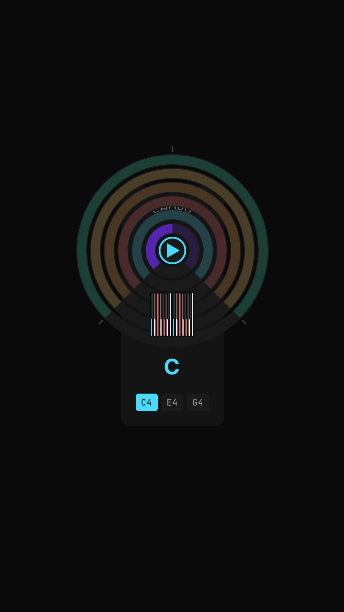 |
| **FractionPicker** | Time signature and ratio picker | 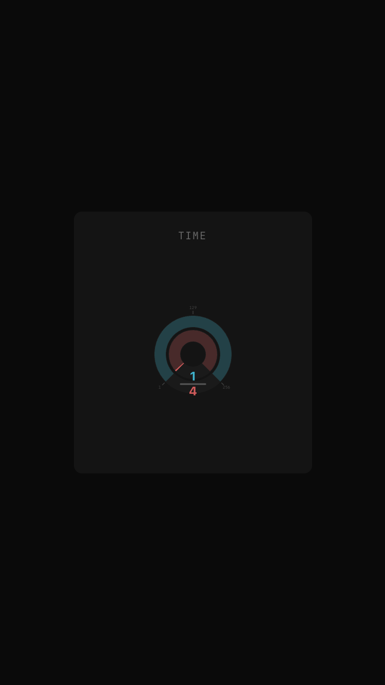 |
| **TimeKnob** | BPM-synced time values | 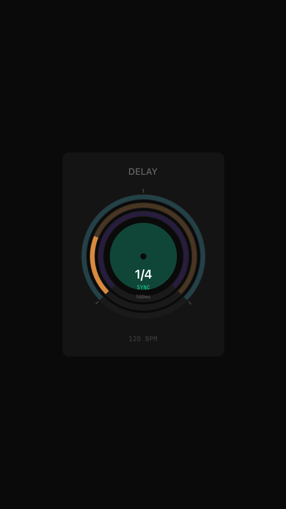 |

### Utilities

| Component | Description |
|-----------|-------------|
| **ModMatrix** | Modulation routing matrix |
| **EffectsChain** | Drag-and-drop effects chain |
| **ParameterInspector** | Debug panel for all parameters |
| **WaveformSelector** | Visual waveform shape picker |

## Primitives

Low-level building blocks for creating custom components:

```tsx
import { Slider, OptionPicker, WaveformPicker, Module } from 'anysynth-components';

// Simple slider with horizontal drag
<Slider value={0.5} onChange={setValue} color="cyan" />

// Button group for options
<OptionPicker options={['LP', 'HP', 'BP']} value="LP" onChange={setFilter} />

// Visual waveform selector
<WaveformPicker value="sine" onChange={setWaveform} />
```

## Theming

```tsx
import { ThemeProvider, useTheme } from 'anysynth-components';

// Wrap your app
<ThemeProvider defaultMode="dark">
  <App />
</ThemeProvider>

// Access theme in components
const { mode, toggleMode, colors } = useTheme();
```

### Color Tokens

| Color | Semantic Usage |
|-------|---------------|
| `coral` | Gain, amplitude, volume |
| `orange` | Filter, resonance |
| `yellow` | LFO rate, modulation |
| `green` | Oscillator, pitch |
| `cyan` | Effects, delay |
| `purple` | Modulation depth |
| `pink` | Envelope, ADSR |

## Development

```bash
# Install dependencies
npm install

# Start Storybook
npm run dev

# Run tests
npm run test

# Type check
npm run typecheck

# Build library
npm run build

# Generate API docs
npm run docs

# Format code
npm run format
```

## Scripts

| Script | Description |
|--------|-------------|
| `npm run dev` | Start Storybook on port 6006 |
| `npm run build` | Build library for production |
| `npm run test` | Run tests in watch mode |
| `npm run test:run` | Run tests once |
| `npm run test:coverage` | Run tests with coverage |
| `npm run typecheck` | TypeScript type checking |
| `npm run lint` | ESLint checking |
| `npm run format` | Format with Prettier |
| `npm run docs` | Generate TypeDoc documentation |

## Browser Support

- Chrome/Edge 90+
- Firefox 90+
- Safari 14+

## License

MIT

## Contributing

1. Fork the repository
2. Create a feature branch
3. Make your changes
4. Run tests: `npm run test:run`
5. Submit a pull request

Pre-commit hooks will automatically format code and run linting.
